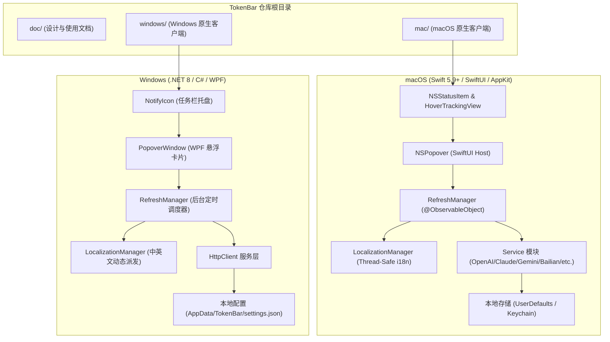

# TokenBar 系统架构设计文档 (ARCH)

> **项目名称**：TokenBar  
> **副标题**：模型额度监控 / Model Quota Monitor  
> **设计原则**：原生轻量、本地私密、分层解耦、双端适配。

---

## 1. 总体架构与代码目录组织

TokenBar 采用跨平台双原生实现策略。针对 macOS 与 Windows 系统的状态栏/托盘事件循环与界面渲染特性的差异，项目在仓库顶层将实现完全解耦为 `mac/` 与 `windows/` 独立工程。



---

## 2. macOS 原生端架构实现 (`mac/`)

macOS 客户端采用纯 Swift 打造，支持 macOS 13 (Ventura) 及以上系统，无需引入任何臃肿的三方框架。

### 2.1 表现层 (Presentation Layer)
- **`MenuBarController`**：
  - 维护系统状态栏 `NSStatusItem`，通过 `HoverTrackingView`（基于 `NSTrackingArea`）监听鼠标悬浮与移出事件。
  - 支持“鼠标悬停快速展开”与“点击固定（Pin）”双重交互模型。悬停 0.15s 展开、移出 0.35s 关闭
    （`hoverOpenDelay` / `hoverCloseDelay`），定时器注册到 `.common` mode。`NSTrackingArea` 只覆盖
    状态栏按钮，鼠标「图标 → 浮窗 → 桌面」后不会再收到 exited，因此 `handleMouseMoved` 在鼠标既不在
    图标也不在浮窗内时必须重新安排关闭；`popoverDidClose` 是状态复位的唯一出口（`.transient`
    点击外部关闭也走它）。
  - 设置窗口的 `NSHostingView` 复用不重建；切 tab 与重新读钥匙串通过 `SettingsWindowRequest`
    通知视图（`.task(id: openCount)`），用户未保存的输入不会因为再次打开而丢失。
  - 绑定 `NSPopover`，将其根视图托管至 SwiftUI `TokenSummaryPopoverView`。
  - 订阅 `RefreshManager.objectWillChange`，按用户配置把某个厂商的剩余额度 / 余额渲染到 `NSStatusItem` 标题（文案由纯函数 `MenuBarStatus` 计算，便于单测）。
  - 弹窗定位两层防护（macOS 26 起状态项托管在系统进程，本进程缓存的状态栏窗口坐标在显示器熄屏/唤醒后可能过期，会把 `NSPopover` 定位到屏幕中央）：
    - 主动层：订阅 `NSApplication.didChangeScreenParametersNotification` 与 `NSWorkspace` 的唤醒通知，去抖后对 `NSStatusItem.length` 做“定长 → 变长”轻推，迫使状态项重新布局并同步坐标。
    - 被动层：悬停/点击触发时由纯函数 `MenuBarAnchor` 用鼠标位置校验缓存的按钮矩形，过期则把 `NSPopover` 挂到一个透明、穿透点击的辅助 `NSPanel` 上，按鼠标位置贴菜单栏锚定；弹窗关闭后回收面板并再轻推一次。
- **SwiftUI 视图组件**：
  - `TokenSummaryPopoverView`：主看板，包含标题区（TokenBar 及中英文副标题）、即时刷新动画按钮、滚动卡片列表以及状态栏。
  - `ProviderCardView` & `CustomProviderCardView`：展示各模型厂商卡片，双窗口（5 小时与每周）进度条及重置时间。
  - `SettingsView`：包含 12 个配置选项卡（OpenAI、Anthropic、Gemini、DeepSeek、火山方舟、KIMI、OpenRouter、GLM、阿里云百炼、国内厂商/自定义、显示顺序、通用设置）。

### 2.2 状态与并发管理 (State & Concurrency Layer)
- **`RefreshManager`**：
  - 单例对象，遵循 `ObservableObject` 协议，向所有视图广播额度变更。
  - 采用 Swift 结构化并发 `withTaskGroup`，当触发全量刷新时，各开启的厂商并行拉取。
  - 定时调度器：使用 `Timer` 按照用户设定周期（1~60 分钟）静默触发，注册到 `.common`
    runloop mode，避免右键菜单/拖拽这类 `.eventTracking` 交互期间被暂停。
  - **定时器在 `init()` 中同步创建，先于首刷**。曾经是"首刷完成后才建定时器"，首刷一旦
    挂起就永远不会有自动刷新。
  - **刷新闸门带看门狗**：`isRefreshing` 配 `refreshStartedAt` + `refreshGeneration`，
    上一轮超过 90 秒未结束时新一轮强制抢占。以前只是 `guard !isRefreshing else { return }`，
    一轮卡死就会让之后每一次 tick 和手动刷新都被静默丢弃。
  - **单厂商超时隔离**：每个 provider 经 `withTimeout`（`TaskTimeout.swift`）套独立预算
    （百炼 35s / Gemini 30s / 其余 25s），单个厂商挂起不拖垮整轮。超时哨兵在操作按时完成时
    会被取消，不会每轮每厂商留下一个睡满预算的悬挂 Task。
  - **设置项的保存必须发生在写入的那一刻**，不能挂在 SwiftUI 的 `.onChange` 副作用里。通用设置
    里的 Picker / Toggle 一律走 `SettingsView.savingBinding(_:)`：setter 内写值并立即 `saveSettings()`。
    曾经是「绑定 settings + 紧随其后的 `.onChange` 调 saveSettings」，而这些控件上还叠了
    `.id(i18n.currentLanguage)`，视图标识重建会把 `onChange` 的基线重置成新值、通知被吞掉 ——
    真实故障是刷新间隔改成 1 分钟后仍按 5 分钟跑了近 3 小时，日志里那段时间完全没有「定时器已创建」。
  - **定时器自愈要比对间隔**：每轮结束走 `RefreshTimerHealth.needsRebuild`（Windows 端为同语义的内联判断），
    除「定时器是否失效」外还比对生效中的间隔与设置值。这是「设置改了却没生效」的最后一道防线，
    最迟一个旧周期自愈。间隔一致时**不得**重建 —— 每次重建都会把计时相位打回零。
  - **轮次门控写回**：各 `refreshXxx` 在入口捕获 `refreshGeneration`，结果经 `commit(_:for:gen:)`
    写回；被闸门抢占的旧轮次跑完后其结果直接丢弃，不会用失败态覆盖新轮次刚写入的数据。
  - **状态型窗口**：`TokenWindowKind.status` 表示「只探测到连通性、拿不到真实额度」，卡片只画
    标题与状态点。各厂商 Service **不得**在拿不到数据时伪造进度条（GLM 曾用 `usedPct * 0.6`
    编造每周额度、Gemini API Key 模式曾用「当前小时 / 5」拼 5 小时窗口，均已删除）；
    `x-ratelimit-reset-*` 统一走 `RateLimitReset.parse`（Go duration / 秒 / unix 秒·毫秒时间戳）。

#### 2.2.1 刷新链路的三条硬约束

这三条都来自真实故障（自动刷新连续 4 小时停摆），改动时不要回退：

1. **所有网络请求走 `HTTPClient`，不用 `URLSession.shared`**。shared 的
   `timeoutIntervalForResource` 默认 **7 天**，而 `URLRequest.timeoutInterval` 只是
   "不活动超时"——代理环境下 TCP 停在 ESTABLISHED、响应慢速滴流时它可能永不触发。
   `HTTPClient` 统一 12s 请求 / 30s 端到端上限，并禁用 URLCache（靠响应头取额度的厂商
   命中缓存会连响应头一起回放旧值）。
2. **钥匙串访问必须在后台线程，且读取结果必须三态**。
   `SecItemCopyMatching` 是同步阻塞调用，经 mach IPC 等 securityd；签名变化触发的授权框、
   钥匙串锁定、securityd 繁忙都会让它久等。一旦发生在 MainActor 上，主线程冻结会让**所有**
   provider 的刷新任务一起停摆（它们全都跑在 MainActor 上），连超时哨兵恢复执行都排不上队。
   同步的 `set` / `delete` / `lookup` 带 `assertOffMain` 断言，DEBUG 下会把误用直接炸出来；
   异步入口是 `lookupAsync` / `setAsync` / `deleteAsync` / `prefetch`（Windows 端对应
   `LookupAsync` / `SetAsync` / `DeleteAsync` / `PrefetchAsync`）。

   **三态（`SecretLookup`: `found` / `absent` / `unavailable`）不是洁癖，是防数据丢失。**
   `String?` 表达不了「确定没有」和「读不到」的差别，而**有写权限的调用方**把两者混为一谈
   就是删掉用户凭证：读取失败 → 输入框留空 → 用户点保存 → 走 delete 分支 → 钥匙串里真实
   存在的账号级长期凭证被抹掉。刷新链路可以容忍「读不到」（降级成未授权，下一轮自愈），
   所以它用 `prefetch`；设置页不行，它必须用 `lookupAsync` 并在 `.unavailable` 下
   **跳过删除**。这条判断抽在 `SecretSaveAction.resolve(input:storeReadable:)` 里，
   有专门的单测守着。

   同理，`resolveCredentials` / `ResolveCredentials` 的 `secretStore` 参数**没有默认值也
   不回退**，必须显式传入预取好的内存快照——默认值会把最危险的选项做成打字最少的选项。

   **这条铁律同样管住 `/usr/bin/security` 子进程路径。** `GeminiService.readKeychainToken`
   读的是 Antigravity 用 go-keyring 写入的条目（service `gemini` / account `antigravity`），
   条目的 ACL 归 Antigravity，TokenBar 不在白名单里——**给自己固定签名身份对它无效**，
   每次读取都可能弹一次系统授权框，而授权框弹出时子进程会无限期挂着等用户。
   `SecretStore` 的 `assertOffMain` 护栏拦不到这条路（它只覆盖 Security framework API），
   所以这里自带三样东西：后台队列执行 + 独立的主线程断言、3 秒 SIGTERM / 再 2 秒 SIGKILL
   看门狗、以及 5 分钟成功缓存 + 30 秒失败冷却。缓存和冷却不是性能优化——没有它们，
   刷新间隔设成 1 分钟就是每分钟弹一次授权框。决策抽在 `KeychainProbeDecision.resolve`
   里，同样有单测守着。
3. **`Process` 子进程要先读 pipe 再 `waitUntilExit`**，并配超时 kill 与
   `standardInput = FileHandle.nullDevice`。反序会在输出超过 64KB pipe 缓冲区时形成
   父子互等死锁；`withTimeout` 救不了子进程（不响应 Task 取消），必须自己兜。

   第 2 条的精神同样适用于**文件 IO**：`~/.claude.json`（重度用户数 MB）、`~/.bailian/config.json`、
   余额历史 `balance_history.json` 都不得在 MainActor 上同步读写。对应入口是
   `ClaudeService.readLocalClaudeJson()`（async）、`BailianCLIConfig.loadFromDiskAsync()`、
   `BalanceHistoryStore`（actor，内存常驻一份，磁盘只在首次访问读一次）。

   **有可变缓存的 Service 必须是 actor**（`GeminiService`：token 缓存、client 候选、钥匙串探测缓存）。
   普通 class 的 nonisolated async 方法从 MainActor `await` 进去后并不在主线程执行，刷新链路与
   设置页「测试」按钮并发进入就是数据竞争。排查此类问题可临时开严格检查：
   `swift build -Xswiftc -strict-concurrency=complete`（目前约 100 条警告，多为 Foundation
   类型未标 Sendable 的噪音，故未固化进 Package.swift）。

#### 2.2.2 可观测性与排查

`Log.swift` 统一日志出口，subsystem `com.tokenbar.mac`，category 分
`timer` / `refresh` / `provider` / `net` / `lifecycle`。级别按落盘规则选：
`.notice` / `.error` 持久化（定时器 fire、轮次起止、厂商超时、闸门抢占），
`.info` / `.debug` 只驻内存（单厂商耗时、排队时间、超时哨兵触发时刻）。

```bash
# 实时观察定时器是否真的按周期 fire
log stream --predicate 'subsystem == "com.tokenbar.mac" AND category IN {"timer","refresh"}' --style compact

# 事后回溯（notice/error 已落盘）
log show --last 1h --predicate 'subsystem == "com.tokenbar.mac"' --info --style compact
```

排查"更新不及时"时，**先看 `timer fired，距上次 xxxs` 是否稳定在设定周期**，再看
`round end` 的耗时与 `provider=xxx TIMEOUT`。若某厂商耗时异常而主线程栈（`sample <pid>`）
显示空闲，怀疑 MainActor 上的同步阻塞（钥匙串、子进程）。

#### 2.2.3 签名与钥匙串 ACL

`Scripts/build_app.sh` 推荐用固定的 Apple Development 证书签名。**签名身份属于每台
机器的本地配置，不进仓库**，取值优先级为：

1. `CODESIGN_IDENTITY` 环境变量；
2. `mac/Scripts/signing.local.env`（已 gitignore，模板见同目录 `signing.local.env.example`）；
3. 都没有则退回 ad-hoc（脚本会打印如何配置的提示）。

首次 clone 后配置一次即可：

```bash
cd mac/Scripts
cp signing.local.env.example signing.local.env
security find-identity -v -p codesigning   # 取行首 40 位 SHA-1 填进去
```

用 SHA-1 哈希而非证书名指定：同名证书可能有多张（例如已吊销的旧证书，
按名字签会撞上它报 `CSSMERR_TP_CERT_REVOKED`）。

为什么不用 ad-hoc：ad-hoc 签名没有稳定的 designated requirement，钥匙串 ACL 只能按
cdhash 匹配，而 cdhash 每次重新编译都变——于是每次构建后首次读钥匙串都会弹授权框，
而这个框卡在主线程上就会冻结整个刷新流程。固定证书签名后 requirement 变成
`identifier "com.tokenbar.mac" and ... certificate leaf[subject.CN] = "..."`，
重新编译不再反复授权。切换签名身份后第一次启动仍会问一次，点「始终允许」即可。

### 2.3 国际化与本地化架构 (`I18n.swift`)
- **设计策略**：
  - 采用强类型枚举 `I18nKey` 管理所有中英文字符串键值。
  - `LocalizationManager` 单例维护 `cachedLanguage` 与 `@Published public var currentLanguage: AppLanguage`。
  - 读操作通过线程锁实现无锁/轻量读取，保证在后台解析线程与主线程均可安全同构调用 `I18n(.key)`。
  - 当用户在设置中变更语言时，通过发布通知与绑定 `@ObservedObject`，所有 UI 视图与系统菜单即时重绘。

---

## 3. Windows 原生端架构实现 (`windows/`)

Windows 客户端采用轻量现代的 **.NET 8 WPF** 架构，利用 Windows 原生消息机制与任务栏通知区（Taskbar Notification Area）无缝交互。

### 3.1 核心组件划分
1. **`TrayIconManager`**：
   - 封装 Windows Forms `NotifyIcon`，集成到右下角托盘。
   - 实现左键单击呼出 `PopoverWindow`、右键弹出多语言原生上下文菜单。
2. **`PopoverWindow`**：
   - 无边框（`WindowStyle="None"`）且透明背景（`AllowsTransparency="True"`）的现代化卡片浮窗。
   - 自动获取任务栏工作区边界（`SystemParameters.WorkArea`），精准定位在托盘图标上方。
3. **`SettingsWindow`**：
   - 独立的偏好设置窗口，提供厂商 Key/端点配置及中英文语言即时切换。
4. **`RefreshManager`**：
   - 基于 `System.Threading.Timer` 运行异步定时调度，定时器在 `Initialize()` 中先于首刷创建。
   - 配置通过 `System.Text.Json` 本地持久化到 `%AppData%\TokenBar\settings.json`。
   - **闸门看门狗**：`Interlocked` 抢占的基础上加 `_refreshStartedAtTicks` + `_refreshGeneration`，
     上一轮超过 90 秒未结束时强制抢占。以前一轮卡死就会让之后每次定时触发与手动刷新
     都被静默丢弃（与 macOS 端同源缺陷，详见 2.2 节）。
   - **单厂商超时隔离** `RunProviderAsync`：`Task.WhenAny(work, Task.Delay(budget))` 给每个
     provider 套独立预算（百炼 35s / Gemini 30s / 其余 25s），超时后补一次 `IsLoading=false`
     收尾，避免卡片一直转圈。`Quotas` 在初始化时已预填充全部 `ProviderType`，各刷新方法
     只改 `ProviderQuota`（class）的属性、不做结构性写入，因此并发访问该 `Dictionary` 是安全的。
   - **日志** `Log.cs`：写入 `%AppData%\TokenBar\tokenbar.log`（2MB 轮转一次）。Windows 没有
     `log stream` 的等价物，排查用 `Get-Content "$env:APPDATA\TokenBar\tokenbar.log" -Wait -Tail 50`。
     关键指标同样是 `timer fired，距上次 xxxs` 是否稳定在设定周期。

> **与 macOS 端的差异**：2.2.1 的第 1 条（`URLSession.shared` 的 7 天 resource 超时、URLCache
> 回放旧响应头）在 Windows 上不成立 —— `HttpClient.Timeout` 本身就是端到端总超时，且
> `SocketsHttpHandler` 默认不做响应缓存。第 2 条的钥匙串阻塞风险也低得多：凭据管理器
> (`CredReadW`) 不会弹授权框，且刷新链路跑在线程池线程而非 UI 线程。第 3 条的 pipe 读取
> 顺序 Windows 端本就正确（先 `ReadToEndAsync` 再 `WaitForExitAsync`），但补上了 20s 超时
> 与 `Kill(entireProcessTree)`，并关闭 stdin 防 `bl` 交互等待。
5. **凭据安全与系统集成 (`GeminiService` / `Advapi32`)**：
   - 原生 P/Invoke 调用 Windows 凭据管理器 (`advapi32.dll` `CredReadW`)，安全提取 Antigravity CLI (`agy`) 及 Antigravity IDE 托管的 Google One PRO 凭证（目标名 `gemini:antigravity`）。
   - 使用凭证中的 refresh_token 自动续期访问令牌（内存缓存约 1 小时有效期），调用 Google Code Assist 配额接口获取与 Antigravity 官方用量面板一致的真实数据；自动请求 Google UserInfo 接口解析用户邮箱，实现与 macOS 凭证管理完全同构。
6. **应用生命周期与单实例 (`App`)**：
   - `OnStartup` 通过命名 Mutex（`Local\TokenBar.SingleInstance.Mutex`）实现单实例保护，避免双托盘图标与重复额度 API 请求。
   - 第二实例启动时经命名 `EventWaitHandle` 通知首实例弹出额度浮窗后自行退出，对齐 macOS「重复启动即激活已有实例」的行为。
   - 首实例正常退出时释放 Mutex；异常崩溃由内核对象随进程销毁兜底，不会造成永久锁死。

---

## 4. 速率限制响应头 (Rate Limit Headers) 解析机制

各大模型厂商在 HTTP API 响应中会携带详细的速率与限额头信息，TokenBar 实现了针对各厂商规范的智能解析器：

```
+-------------------+-------------------------------------------------------------+
| 平台              | 核心响应头与解析策略                                        |
+-------------------+-------------------------------------------------------------+
| OpenAI            | x-ratelimit-remaining-tokens (剩余TPM)                      |
|                   | x-ratelimit-remaining-requests (剩余RPM)                    |
|                   | x-ratelimit-reset-tokens (重置时间，格式形如 1s, 6m0s)      |
+-------------------+-------------------------------------------------------------+
| Anthropic API     | anthropic-ratelimit-tokens-remaining                        |
|                   | anthropic-ratelimit-tokens-reset (ISO8601 时间戳)           |
+-------------------+-------------------------------------------------------------+
| Claude Code       | 本地读取 ~/.claude.json 会话配置与 OAuth 令牌，             |
|                   | 解析 5 小时滚动滑动窗口百分比与每周额度配额                 |
+-------------------+-------------------------------------------------------------+
| Google Gemini /   | 1. API Key 模式：直连 Generative Language API 探测配额状态；|
| Google One /      | 2. 账号授权 / Antigravity 模式（与 Antigravity 官方面板同源）：|
| Antigravity       |    - Windows: 原生 P/Invoke 调用 Windows 凭据管理器          |
|                   |      (`advapi32.dll` `CredReadW`) 安全读取 `gemini:antigravity`|
|                   |      Generic Credential；同时兼容读取 `%USERPROFILE%\.gemini\`|
|                   |      凭证文件；macOS: 读取 `~/.gemini/` 会话；               |
|                   |    - 使用 agy CLI 内置 OAuth 客户端自动刷新访问令牌，调用    |
|                   |      Google Code Assist `v1internal:retrieveUserQuotaSummary`|
|                   |      获取 "Gemini Models" 分组的每周 / 5 小时剩余比例与真实  |
|                   |      重置时间（fetchAvailableModels 逐模型兜底聚合）；       |
|                   |    - 支持内置 OAuth 2.0 Web 回环授权；获取失败时如实报错。  |
+-------------------+-------------------------------------------------------------+
| DeepSeek          | 查询 /user/balance 接口获取实时账户余额与赠送金额           |
+-------------------+-------------------------------------------------------------+
| 阿里云百炼         | 四级通道，顺序即优先级：                                     |
|                   | 1. AK/SK 原生（首选，双端并发）：以 ACS3-HMAC-SHA256 签名调用 |
|                   |    modelstudio.<region>.aliyuncs.com/modelstudio/cli/       |
|                   |    generateAccessToken (GenerateCLIAccessToken, 2026-02-10)  |
|                   |    换取控制台令牌，再以 Bearer 直调 /cli/api.json 网关查询    |
|                   |    tokenplan/personal/api/v2/usage；网关返回 NotLogined 时    |
|                   |    自动重新签发令牌并单次重试，天然规避 Web SSO 单点互踢；    |
|                   | 2. 只读复用本机 ~/.bailian/config.json 中已有的控制台令牌；   |
|                   | 3. 备用：官方 CLI (`bl usage token-plan --output json`) 子进程；|
|                   | 4. 兜底：控制台 Cookie 直调 /data/api.json 网关。             |
|                   | 响应解析统一走多层 unwrap，兼容以上三种嵌套形状。            |
|                   | 另经 BSS OpenAPI QueryAccountBalance 查询阿里云账户现金余额。|
+-------------------+-------------------------------------------------------------+
```

---

## 5. 安全与隐私架构

1. **本地存储隔离**：
   - 所有 API Key、OAuth Token 与用户设置均直接保存在用户本地电脑磁盘中，不上传至任何中心化云服务。
   - **全部凭证不落明文配置**：各厂商 API Key、Claude / Gemini OAuth token、控制台 Cookie、自定义厂商的
     Key 与 Cookie、阿里云 AccessKey Secret 与控制台令牌，macOS 一律存入系统钥匙串（Security.framework，
     service `TokenBar`，account 名见 `SecretKey` / `AppSecrets`），Windows 存入凭据管理器（`CredWriteW`，
     TargetName `TokenBar/<同名>`）。`AppSettings` 在内存里仍持有明文供刷新链路与设置页使用，
     但 macOS 的 `AppSettings.encode(to:)` / Windows 的 `AppSettings.SerializeForDisk()` 在
     `secretsInKeychain` / `SecretsInKeychain` 为 true 时不再把任何凭证写进 plist / settings.json。
   - **迁移与三态**：启动时 `RefreshManager.loadSecretsFromKeychain`（Windows：`LoadSecretsFromStoreAsync`）
     用 `lookupAll` / `LookupAllAsync` 逐键三态读取：
     found → 以安全存储为准；absent 且旧明文非空 → 迁入安全存储；unavailable → 保留旧明文、什么都不写不删，
     标志保持 false 让明文继续落盘兜底。全部键可信且迁移成功后才置 true 并重写配置清掉明文。
     保存时 `syncSecretsToKeychain` / `SyncSecretsToStoreAsync` 按差异写 / 删，「输入为空且这轮没读到」
     只保留不删（`AppSecrets.saveAction` / `AppSecrets.ResolveSave`，两端各有单测）。
     安全存储不可用时**不降级为新的明文写入**，而是在设置页横幅如实报错并保持既有明文兜底。
     自定义厂商被删除时，它的两个条目由差异同步顺带删除，**不要另开删除路径** —— 那会与同步任务
     在线程池上并发改同一份对齐表。
   - 网页授权窗口（`WebLoginWindowController`）使用非持久化 `WKWebsiteDataStore`，不把第三方整站登录态落进
     App 容器；completion 只触发一次。`GeminiService` 不再写回 Antigravity 的 `~/.gemini/jetski-standalone-oauth-token`。
   - 本机 `~/.bailian/config.json`（百炼 CLI 的配置）只读复用，**绝不写回** —— CLI 用 tmp+rename
     原子替换整个文件，并发写会覆盖掉它的其他字段。
2. **纯客户端通讯**：
   - 应用直接向模型提供商官方接入端点发起 HTTPS 请求，无任何二次代理服务器。
3. **开源透明**：
   - 代码遵循 MIT 许可证完全开源，可由社区开发者独立审计与验证。
