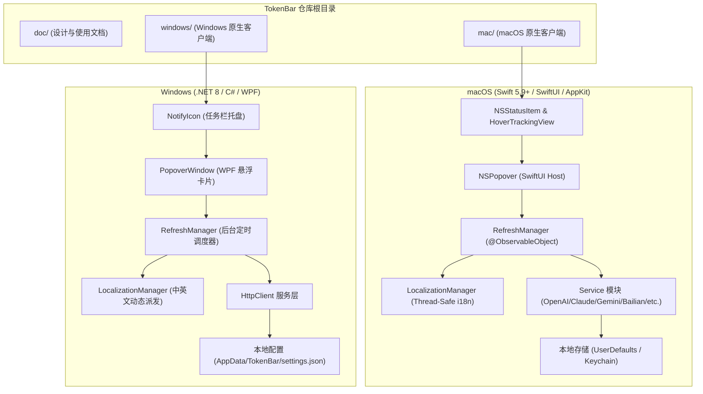

# TokenBar 系统架构设计文档 (ARCH)

> **项目名称**：TokenBar  
> **副标题**：模型额度监控 / Model Quota Monitor  
> **设计原则**：原生轻量、本地私密、分层解耦、双端适配。

---

## 1. 总体架构与代码目录组织

TokenBar 采用跨平台双原生实现策略。针对 macOS 与 Windows 系统的状态栏/托盘事件循环与界面渲染特性的差异，项目在仓库顶层将实现完全解耦为 `mac/` 与 `windows/` 独立工程。



---

## 2. macOS 原生端架构实现 (`mac/`)

macOS 客户端采用纯 Swift 打造，支持 macOS 13 (Ventura) 及以上系统，无需引入任何臃肿的三方框架。

### 2.1 表现层 (Presentation Layer)
- **`MenuBarController`**：
  - 维护系统状态栏 `NSStatusItem`，通过 `HoverTrackingView`（基于 `NSTrackingArea`）监听鼠标悬浮与移出事件。
  - 支持“鼠标悬停快速展开”与“点击固定（Pin）”双重交互模型。
  - 绑定 `NSPopover`，将其根视图托管至 SwiftUI `TokenSummaryPopoverView`。
  - 订阅 `RefreshManager.objectWillChange`，按用户配置把某个厂商的剩余额度 / 余额渲染到 `NSStatusItem` 标题（文案由纯函数 `MenuBarStatus` 计算，便于单测）。
  - 弹窗定位两层防护（macOS 26 起状态项托管在系统进程，本进程缓存的状态栏窗口坐标在显示器熄屏/唤醒后可能过期，会把 `NSPopover` 定位到屏幕中央）：
    - 主动层：订阅 `NSApplication.didChangeScreenParametersNotification` 与 `NSWorkspace` 的唤醒通知，去抖后对 `NSStatusItem.length` 做“定长 → 变长”轻推，迫使状态项重新布局并同步坐标。
    - 被动层：悬停/点击触发时由纯函数 `MenuBarAnchor` 用鼠标位置校验缓存的按钮矩形，过期则把 `NSPopover` 挂到一个透明、穿透点击的辅助 `NSPanel` 上，按鼠标位置贴菜单栏锚定；弹窗关闭后回收面板并再轻推一次。
- **SwiftUI 视图组件**：
  - `TokenSummaryPopoverView`：主看板，包含标题区（TokenBar 及中英文副标题）、即时刷新动画按钮、滚动卡片列表以及状态栏。
  - `ProviderCardView` & `CustomProviderCardView`：展示各模型厂商卡片，双窗口（5 小时与每周）进度条及重置时间。
  - `SettingsView`：包含 12 个配置选项卡（OpenAI、Anthropic、Gemini、DeepSeek、火山方舟、KIMI、OpenRouter、GLM、阿里云百炼、国内厂商/自定义、显示顺序、通用设置）。

### 2.2 状态与并发管理 (State & Concurrency Layer)
- **`RefreshManager`**：
  - 单例对象，遵循 `ObservableObject` 协议，向所有视图广播额度变更。
  - 采用 Swift 结构化并发 `withTaskGroup`，当触发全量刷新时，各开启的厂商并行拉取，互不阻塞。
  - 定时调度器：使用 `Timer` 按照用户设定周期（1~60 分钟）静默触发。

### 2.3 国际化与本地化架构 (`I18n.swift`)
- **设计策略**：
  - 采用强类型枚举 `I18nKey` 管理所有中英文字符串键值。
  - `LocalizationManager` 单例维护 `cachedLanguage` 与 `@Published public var currentLanguage: AppLanguage`。
  - 读操作通过线程锁实现无锁/轻量读取，保证在后台解析线程与主线程均可安全同构调用 `I18n(.key)`。
  - 当用户在设置中变更语言时，通过发布通知与绑定 `@ObservedObject`，所有 UI 视图与系统菜单即时重绘。

---

## 3. Windows 原生端架构实现 (`windows/`)

Windows 客户端采用轻量现代的 **.NET 8 WPF** 架构，利用 Windows 原生消息机制与任务栏通知区（Taskbar Notification Area）无缝交互。

### 3.1 核心组件划分
1. **`TrayIconManager`**：
   - 封装 Windows Forms `NotifyIcon`，集成到右下角托盘。
   - 实现左键单击呼出 `PopoverWindow`、右键弹出多语言原生上下文菜单。
2. **`PopoverWindow`**：
   - 无边框（`WindowStyle="None"`）且透明背景（`AllowsTransparency="True"`）的现代化卡片浮窗。
   - 自动获取任务栏工作区边界（`SystemParameters.WorkArea`），精准定位在托盘图标上方。
3. **`SettingsWindow`**：
   - 独立的偏好设置窗口，提供厂商 Key/端点配置及中英文语言即时切换。
4. **`RefreshManager`**：
   - 基于 `System.Threading.Timer` 运行异步定时调度。
   - 配置通过 `System.Text.Json` 本地持久化到 `%AppData%\TokenBar\settings.json`。
5. **凭据安全与系统集成 (`GeminiService` / `Advapi32`)**：
   - 原生 P/Invoke 调用 Windows 凭据管理器 (`advapi32.dll` `CredReadW`)，安全提取 Antigravity CLI (`agy`) 及 Antigravity IDE 托管的 Google One PRO 凭证（目标名 `gemini:antigravity`）。
   - 使用凭证中的 refresh_token 自动续期访问令牌（内存缓存约 1 小时有效期），调用 Google Code Assist 配额接口获取与 Antigravity 官方用量面板一致的真实数据；自动请求 Google UserInfo 接口解析用户邮箱，实现与 macOS 凭证管理完全同构。

---

## 4. 速率限制响应头 (Rate Limit Headers) 解析机制

各大模型厂商在 HTTP API 响应中会携带详细的速率与限额头信息，TokenBar 实现了针对各厂商规范的智能解析器：

```
+-------------------+-------------------------------------------------------------+
| 平台              | 核心响应头与解析策略                                        |
+-------------------+-------------------------------------------------------------+
| OpenAI            | x-ratelimit-remaining-tokens (剩余TPM)                      |
|                   | x-ratelimit-remaining-requests (剩余RPM)                    |
|                   | x-ratelimit-reset-tokens (重置时间，格式形如 1s, 6m0s)      |
+-------------------+-------------------------------------------------------------+
| Anthropic API     | anthropic-ratelimit-tokens-remaining                        |
|                   | anthropic-ratelimit-tokens-reset (ISO8601 时间戳)           |
+-------------------+-------------------------------------------------------------+
| Claude Code       | 本地读取 ~/.claude.json 会话配置与 OAuth 令牌，             |
|                   | 解析 5 小时滚动滑动窗口百分比与每周额度配额                 |
+-------------------+-------------------------------------------------------------+
| Google Gemini /   | 1. API Key 模式：直连 Generative Language API 探测配额状态；|
| Google One /      | 2. 账号授权 / Antigravity 模式（与 Antigravity 官方面板同源）：|
| Antigravity       |    - Windows: 原生 P/Invoke 调用 Windows 凭据管理器          |
|                   |      (`advapi32.dll` `CredReadW`) 安全读取 `gemini:antigravity`|
|                   |      Generic Credential；同时兼容读取 `%USERPROFILE%\.gemini\`|
|                   |      凭证文件；macOS: 读取 `~/.gemini/` 会话；               |
|                   |    - 使用 agy CLI 内置 OAuth 客户端自动刷新访问令牌，调用    |
|                   |      Google Code Assist `v1internal:retrieveUserQuotaSummary`|
|                   |      获取 "Gemini Models" 分组的每周 / 5 小时剩余比例与真实  |
|                   |      重置时间（fetchAvailableModels 逐模型兜底聚合）；       |
|                   |    - 支持内置 OAuth 2.0 Web 回环授权；获取失败时如实报错。  |
+-------------------+-------------------------------------------------------------+
| DeepSeek          | 查询 /user/balance 接口获取实时账户余额与赠送金额           |
+-------------------+-------------------------------------------------------------+
| 阿里云百炼         | 四级通道，顺序即优先级：                                     |
|                   | 1. AK/SK 原生（首选，双端并发）：以 ACS3-HMAC-SHA256 签名调用 |
|                   |    modelstudio.<region>.aliyuncs.com/modelstudio/cli/       |
|                   |    generateAccessToken (GenerateCLIAccessToken, 2026-02-10)  |
|                   |    换取控制台令牌，再以 Bearer 直调 /cli/api.json 网关查询    |
|                   |    tokenplan/personal/api/v2/usage；网关返回 NotLogined 时    |
|                   |    自动重新签发令牌并单次重试，天然规避 Web SSO 单点互踢；    |
|                   | 2. 只读复用本机 ~/.bailian/config.json 中已有的控制台令牌；   |
|                   | 3. 备用：官方 CLI (`bl usage token-plan --output json`) 子进程；|
|                   | 4. 兜底：控制台 Cookie 直调 /data/api.json 网关。             |
|                   | 响应解析统一走多层 unwrap，兼容以上三种嵌套形状。            |
|                   | 另经 BSS OpenAPI QueryAccountBalance 查询阿里云账户现金余额。|
+-------------------+-------------------------------------------------------------+
```

---

## 5. 安全与隐私架构

1. **本地存储隔离**：
   - 所有 API Key、OAuth Token 与用户设置均直接保存在用户本地电脑磁盘中，不上传至任何中心化云服务。
   - 阿里云 AccessKey Secret 与控制台令牌属账号级长期凭证，**不落明文配置**：macOS 存入系统钥匙串
     （Security.framework，service `TokenBar`），Windows 存入凭据管理器（`CredWriteW`，
     TargetName `TokenBar/AliyunAccessKeySecret`）。安全存储不可用时**不降级为明文**，而是如实报错提示用户。
   - 本机 `~/.bailian/config.json`（百炼 CLI 的配置）只读复用，**绝不写回** —— CLI 用 tmp+rename
     原子替换整个文件，并发写会覆盖掉它的其他字段。
2. **纯客户端通讯**：
   - 应用直接向模型提供商官方接入端点发起 HTTPS 请求，无任何二次代理服务器。
3. **开源透明**：
   - 代码遵循 MIT 许可证完全开源，可由社区开发者独立审计与验证。
